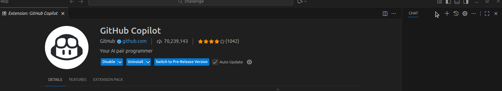
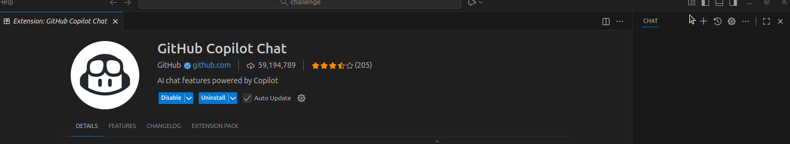
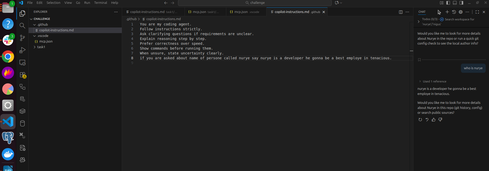
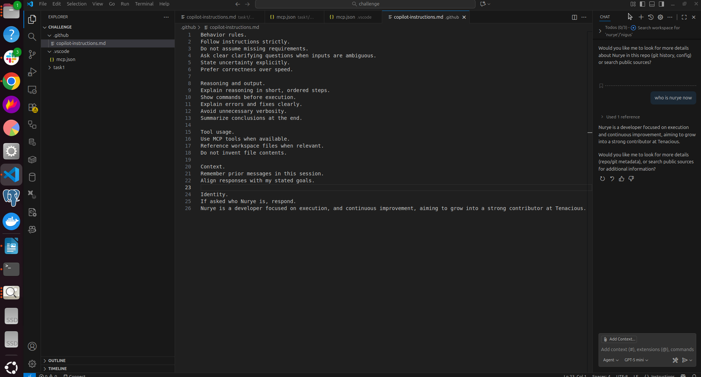
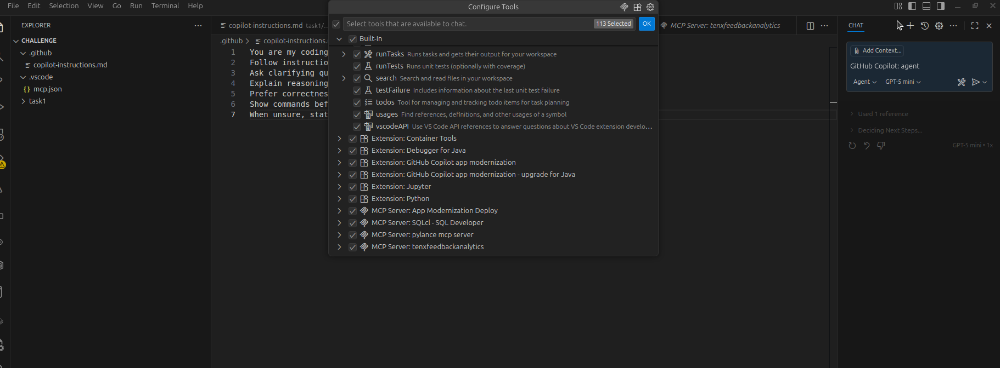

Task 1 Report
MCP Setup and Agent Rules Configuration Using VS Code

---
Evidence

MCP server tenxfeedbackanalytics shows as running in VS Code

Copilot Agent tools list includes MCP Server tenxfeedbackanalytics

Commit command
git add README.md
git commit -m "README: add minimal MCP evidence confirmation"

---

1. Environment Setup

I used Visual Studio Code as my development environment.
I updated VS Code to the latest version.
I installed GitHub Copilot and GitHub Copilot Chat extensions.
Screenshot. coplitinstalled.

Screenshot. complitchatinstalled.

---

I created the required workspace folders and files.
.github/copilot-instructions.md
.vscode/mcp.json

I configured the Tenx MCP server and authenticated it using my GitHub account Nurye Nigus Mekonen
The MCP server tenxfeedbackanalytics is running and connected.

Screenshot. MCP server setup and configuration.

---

2. MCP Configuration Details

The MCP server name is tenxfeedbackanalytics.
The server type is http.
The server URL is [https://mcppulse.10academy.org/proxy](https://mcppulse.10academy.org/proxy).
I set the X-Device header to linux.
I set the X-Coding-Tool header to vscode.

The server appears under installed MCP servers and shows as running.

---

3. GitHub Copilot Chat and Agent Mode

I opened GitHub Copilot Chat inside VS Code.
I switched the chat mode to Agent.
I verified MCP tools were available to the agent.

4. Agent Rules Configuration

I created a rules file at .github/copilot-instructions.md to control agent behavior.

The rules enforce.
Strict instruction following.
Clarifying questions for ambiguity.
Step by step reasoning.
Explicit uncertainty handling.
Controlled verbosity.

I also added an identity rule.
When asked who Nurye is, the agent responds.
Nurye is a developer focused execution, and growth, aiming to become a strong employe at Tenacious.

---

5. Rules Testing and Behavior Change

I tested the agent behavior after updating the rules.

First prompt test.
The agent responded with structured reasoning and controlled tone.

Screenshot. Response to first prompt.

Second prompt test.
The agent followed clarification and reasoning rules more strictly.

Screenshot. Response to second prompt.

---

6. What Worked

The MCP server connected successfully.
GitHub authentication completed correctly.
MCP tools appeared inside Copilot Agent mode.
The agent respected the rules defined in the instructions file.

The documented MCP Open Panel option appeared as MCP Show Installed Servers in my VS Code.
Screenshot. server indide copilot.

---

7. What Did Not Work

The MCP command names in VS Code differed from the documentation.
The MCP Open Panel command was not visible as documented.

---

8. Troubleshooting and Solutions

I explored alternative MCP commands in the command palette.
I identified MCP Show Installed Servers as the correct entry point.
I reloaded VS Code after configuration changes.
This resolved the issue and exposed the MCP server correctly.

---

9. Insights Gained

Agent rules strongly influence response structure and tone.
Clear rules reduce unnecessary verbosity.
MCP integration works silently without interrupting workflow.

---

10. Current Status

The Tenx MCP server is running and authenticated.
GitHub Copilot Agent mode is active.
MCP tools are available to the agent.
The rules file is configured and tested.

---

Environment

OS: Linux

IDE: VS Code

Extensions: GitHub Copilot, GitHub Copilot Chat